<div align="center">


# Ocarina Songbook

**🎶 A personal songbook for practising the 12-hole ocarina**

[](https://victorbolanos.github.io/Ocarina-Songbook)
[](https://github.com/VictorBolanos/Ocarina-Songbook/stargazers)

**Your songs as plain JSON files, shown as note names or fingering diagrams, played back with a synthesized ocarina — no server, no account, no build step**

[Features](#-features) • [Demo](#-demo) • [Technologies](#-technologies) • [Installation](#-installation) • [User Guide](#-user-guide)

Live application: https://victorbolanos.github.io/Ocarina-Songbook

</div>

---

## 📖 Overview

Ocarina Songbook is a small, self-contained web page for learning and practising songs on the 12-hole ocarina. You keep your songs in a folder on your computer, browse them from a searchable list, and open any song to read it as note names, as fingering diagrams, or both — and to hear it. It also comes with a step-by-step song editor, a metronome, a fingering editor, a note detector that listens to your ocarina, importing from MIDI and audio files, transposing, offline use as an installable app, and export to MIDI, WAV, MP4 and a score image (PNG).

The interface comes in **Spanish and English**: the flag button in the top bar (next to the folder name) switches it (in English the notes are shown as `C D E F G A B`).

### 🎯 Why Ocarina Songbook?

- ✅ **Your songs are yours** - One human-readable `.json` file per song, in a folder you choose
- ✅ **Zero setup** - Plain HTML, CSS and JavaScript: no server, no dependencies, no build step
- ✅ **Private** - Nothing is uploaded anywhere and there is no tracking
- ✅ **Made for the ocarina** - Fingering diagrams, an ocarina-like synthesized voice, key signatures
- ✅ **Works without a connection** - Install it as an app (or just open it): the page and your songs stay available at the music stand, with no coverage
- ✅ **Scores you can print** - Export any song as a real staff score (PNG) with the note values, the key and the fingerings under the notes
- ✅ **Made for your phone too** - A layout designed for touch screens, and on Android Chrome you can even connect a folder and edit; publish it on GitHub Pages to read your songs anywhere
- ✅ **Two languages** - Spanish and English, with a one-click switch
- ✅ **Free & Open Source** - No paywalls, no ads

---

## ✨ Features

### 🎼 **Song Library**
> **Status:** ✅ **FULLY IMPLEMENTED**

A searchable list of your songs, with categories and tags.

<div align="center">

<a href="docs/screenshots/song-list.png">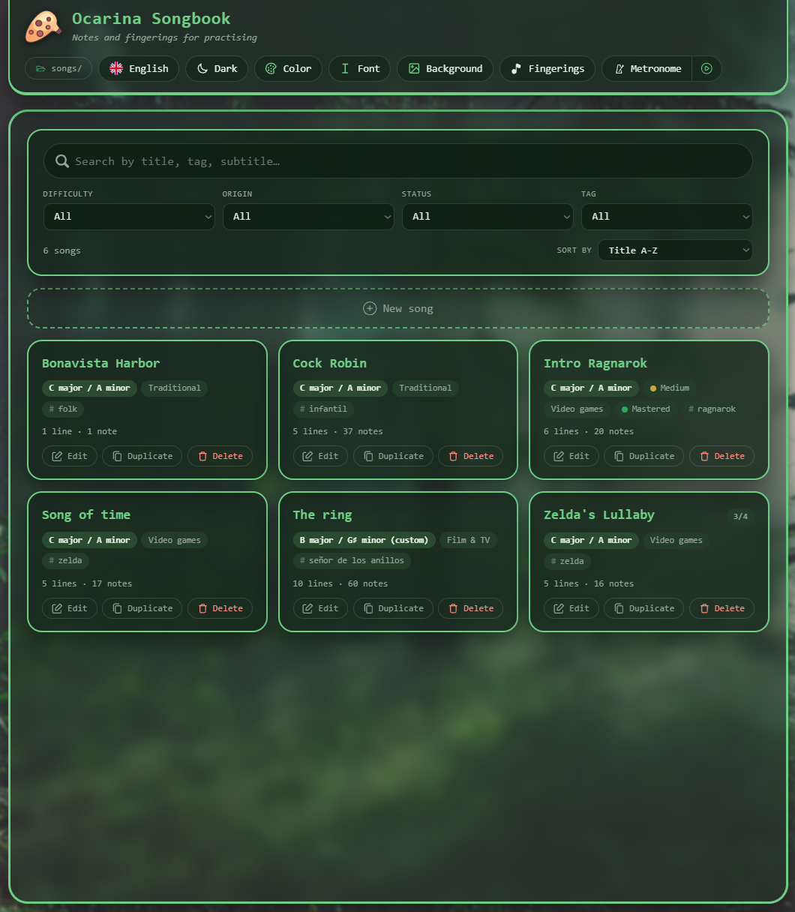</a>

<sub>Search, filter and sort; every card shows the song's key, categories and tags, and lets you edit, duplicate or delete it.</sub>

</div>

**Key Features:**
- 🔎 **Search** - By title, tag, category, key or line subtitle (accent and case insensitive)
- 🏷️ **Categories & tags** - Difficulty, origin, status and free-form tags, with filters and sorting
- 🎹 **Key on every card** - The key of each song, worked out from its notes
- 📂 **Songs are files** - Edit them in the page or in any text editor; changes are picked up when you come back to the tab

---

### ✍️ **Song Editor**
> **Status:** ✅ **FULLY IMPLEMENTED**

Write songs with a note palette or straight from the keyboard.

**Key Features:**
- 🎹 **Note palette** - Three octaves, the accidentals of the song's key, and rests
- ⏱️ **Note values** - Sixteenth to whole notes, dotted or not, with a tempo (BPM) per song
- ⌨️ **Keyboard entry** - `1`–`7` for the notes, `0` for a rest, `+`/`-` for sharps and flats, arrows for octaves
- 🧩 **Lines** - Optional subtitles, duplicate, reorder with buttons, keyboard or drag and drop
- ♻️ **Duplicate a song** - Open a copy to write a variant of it
- ⚠️ **Range warning** - Notes the ocarina cannot play (outside A4–F6) are outlined in red, dimmed in the palette, and counted in a notice under the form
- 🔄 **Transpose** - Raise or lower the whole song by half steps or octaves to fit your ocarina, with a live check of what still falls outside
- ↩️ **Undo & redo** - And nothing touches your folder until you press **Done**

**How it works:**
1. Press **New song** and choose the accidentals: none, flats or sharps
2. Add notes from the palette or with the keyboard
3. The key of the song updates as you write
4. Press **Done** to save it as a `.json` file (or `Esc` to discard)

<div align="center">

<a href="docs/screenshots/editor.png">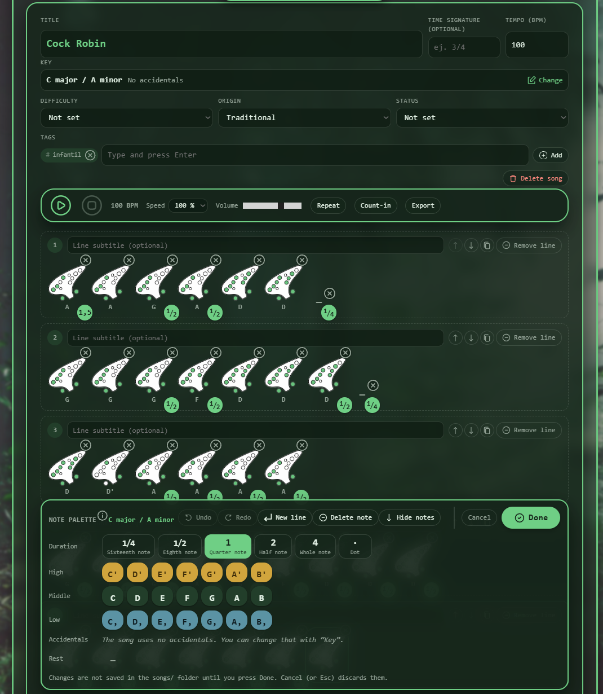</a>

<sub>The form on top, the player right above the lines of the score, and the note palette below it.</sub>

</div>

---

### 🔊 **Playback**
> **Status:** ✅ **FULLY IMPLEMENTED**

An ocarina-like voice synthesized in the browser — nothing to download.

<div align="center">

<a href="docs/screenshots/song-view.png">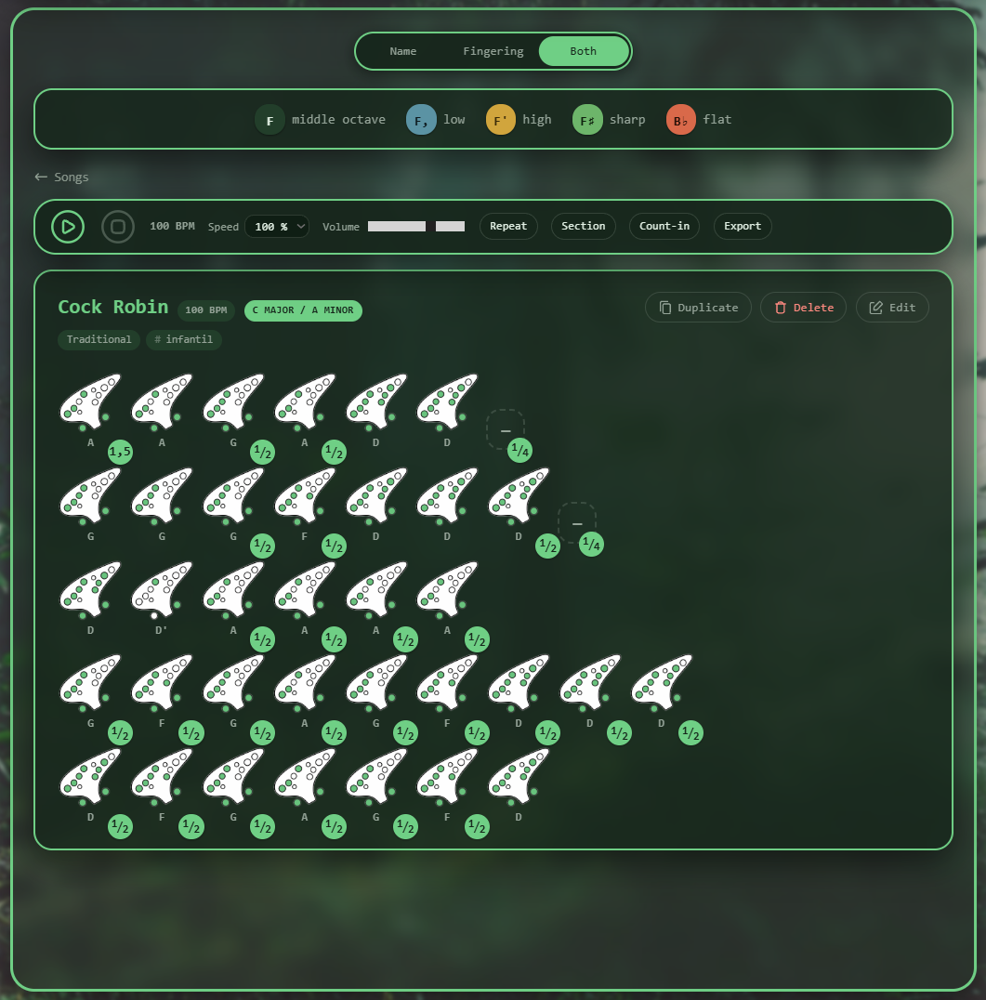</a>

<sub>A song with its player bar: every note shows its fingering and its name, and the badge on the corner is its length.</sub>

</div>

**Key Features:**
- ▶️ **Play, pause, stop** - The note that is sounding lights up
- 🎯 **Play from any note** - Click a note (or select it in the editor and press play)
- 🔁 **Repeat & stretch** - Loop the whole song, or just a stretch you mark
- 🐢 **Speed** - Slow the song down for practice without changing its saved tempo
- 🥁 **Count-in** - A bar of clicks before the song starts
- 📤 **Export** - MIDI, WAV, MP4 or a PNG image of the score

<div align="center">

<a href="docs/screenshots/export.png">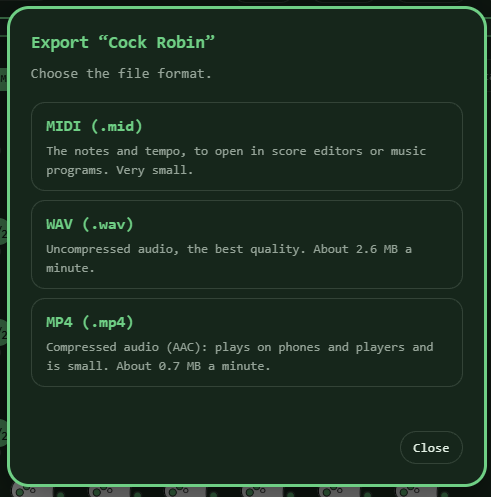</a>

<sub>Export: MIDI for score editors, WAV for the best quality, MP4 for phones and players, PNG for the printed score.</sub>

</div>

---

### 🖼️ **Score Image**
> **Status:** ✅ **FULLY IMPLEMENTED**

Your song as a printed-style score, in one PNG.

<div align="center">

<a href="docs/screenshots/score-both.png">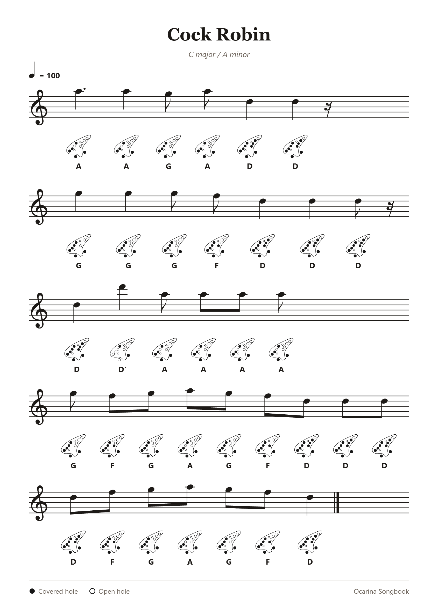</a>

<sub>A song exported in Both mode: a staff per line, the note values drawn, and the fingering and name of every note under it.</sub>

</div>

**Key Features:**
- 🎼 **One staff per line** - Every line of the song is a staff of its own, with its subtitle above it; a line too long for the page continues on another staff
- 🎵 **Real note values** - Whole, half, quarter, eighth and sixteenth notes and rests, dotted or not, with heads, stems, flags and beams where a score has them
- 🎹 **Clef, key and time** - A treble clef, the key signature and the time signature; accidentals only where the key needs them, and bar lines when the notes fit the time signature
- 🖐️ **You choose what goes under the notes** - Names, fingering diagrams or both (a fingering that is not finished shows the note's name)
- 🖨️ **Ready to print or share** - Black on white whatever the page's theme, sharp on screen and on paper

**How it works:**
1. Open a song and press **Export**, then **PNG**
2. Pick **Names**, **Fingerings** or **Both**
3. Press **Create image**: the file is saved as `<song-id>.png`

<div align="center">

<a href="docs/screenshots/png-choice.png">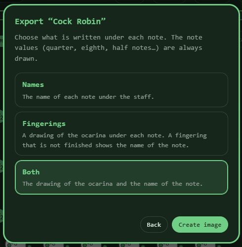</a>

<sub>Choose what goes under the notes; the window starts on the view you have open.</sub>

</div>

---

### 🎚️ **Metronome & Note Detector**
> **Status:** ✅ **FULLY IMPLEMENTED**

A metronome in the top bar that keeps ticking while you read — and, in the same window, a second tab that listens to you play and tells you which note it hears.

**Key Features:**
- 🎵 **Tempo** - Arrows, slider, typing, or tap it in; one click to use the song's tempo
- 🔢 **Beats per bar** - The first beat is accented
- ➗ **Subdivisions** - Quarters, eighths, triplets or sixteenths
- ⏯️ **Quick play/stop** - A small button next to it, without opening the window

<div align="center">

<a href="docs/screenshots/metronome.png">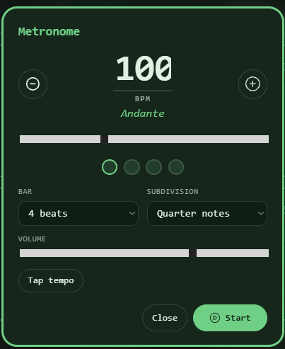</a>

<sub>The metronome: tempo with its Italian name, the beats of the bar, the subdivision and a tap-tempo button.</sub>

</div>

**The note detector** (the *Note detector* tab of the same window):
- 🎤 **Play and read** - Turn the microphone on and play: the page shows the note it hears, in the same names as the rest of the page (`Sol`, `Sol'` high, `Sol,` low), with the sharp or flat spelling and the frequency in Hz
- 🎯 **In tune or not** - A needle shows how many cents sharp or flat you are, and turns green when you are within a few cents
- 🎼 **Practise one note** - Pick a note in *Note to practise*: a small keyboard per octave (high notes on top, all three the same shape) with the same coloured bubbles as the song editor, the naturals in a row and the notes with an accidental above, between the two they sit between; the keys the ocarina cannot play are faded. Choose whether those are written with sharps (♯) or flats (♭) and the whole tool follows; press the chosen note again, or *Any note*, to go back to free playing. The page remembers both choices and it tells you whether you are above or below it: "A little sharp (+12 cents)" when it is the right note but off, or "Below Sol: 2 semitones" ("an octave" when you are an octave away) when it is another note. The note you are playing is shown as always
- 🧠 **Made for the ocarina** - An ocarina sounds almost like a pure tone, so the note is found with the YIN pitch algorithm: from A4 to F6 it named every note correctly, to within a few cents, in tests with added noise
- 🔒 **Private** - The sound is only analysed on your device; it is never recorded or sent anywhere, and the microphone is released when you leave the tab or close the window

<div align="center">

<a href="docs/screenshots/detector.png">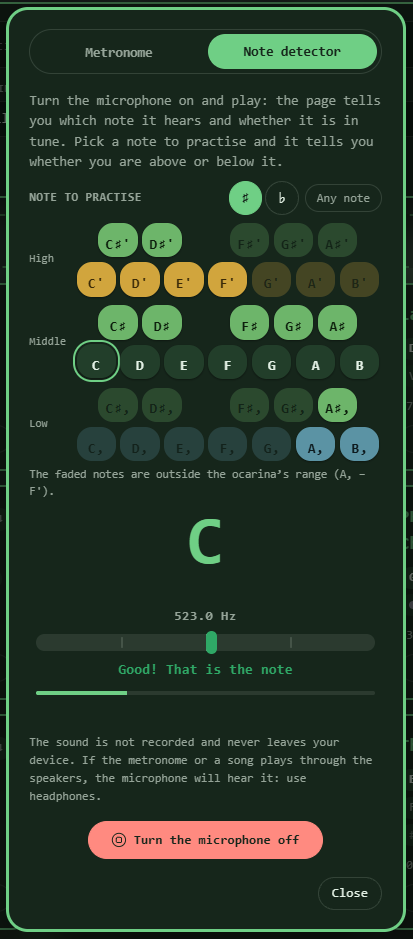</a>

<sub>The note detector: pick a note on the keyboard, play, and it shows what you are playing, how in tune it is and whether you are above or below the note you practise.</sub>

</div>


---

### 🎹 **MIDI & Audio Import**
> **Status:** ✅ **FULLY IMPLEMENTED**

Writing notes by hand is the slow part: bring a melody in from a `.mid` file or from a recording instead.

**From a MIDI file:**
- 📥 **Import file** - The button next to *New song* opens any Standard MIDI File (format 0 or 1) as a new song
- 🎼 **Pick the melody** - Every track (and channel) with notes is listed, with its number of notes and range; the busiest is chosen for you, and drums are left out
- 🧩 **Made into a tune** - Chords keep their top note, notes are snapped to sixteenths, gaps become rests, and long notes are split into the values the page has
- ⏱️ **Tempo, time and key** - Taken from the file, and the notes are cut into lines of two bars

**From an audio file** (WAV, MP3, M4A, MP4, OGG…):
- 🎧 **It listens and writes the notes down** - The browser decodes the file and the page follows the pitch every 10 ms (the same tracker as the note detector), cuts the sound into notes, estimates the tempo and turns them into a song
- 🎛️ **Tempo and sensitivity are yours** - Halve or double the estimated tempo, or type one, and choose whether short notes are kept
- ⚠️ **One melody only** - The window always warns: with more than one instrument or sound at once (accompaniment, bass, drums, voices) **the result will be garbage**. It also measures how clear the recording is and shouts louder when it looks like a mix
- ✅ **What it is good for** - Your own recordings of a solo ocarina, flute, voice or whistle, or any clean single-line audio

**For both:**
- 🎯 **Fitted to the ocarina** - The octaves are moved so as many notes as possible land in A4–F6; the rest are flagged and can be transposed
- ✋ **Nothing saved yet** - The result opens in the editor as a draft: fix it, transpose it, and press **Done** (or discard it)

**How it works:**
1. On the song list press **Import file** and choose a `.mid`, `.wav`, `.mp3`, `.m4a` or `.mp4` file
2. MIDI: pick the track that carries the melody. Audio: read the warning, wait for the analysis and check the tempo
3. See what will happen (notes, tempo, octaves, notes out of range) and press **Open in the editor**, check the song and press **Done**

<div align="center">

| From a MIDI file | From an audio file |
|:---:|:---:|
| <a href="docs/screenshots/import-midi.png">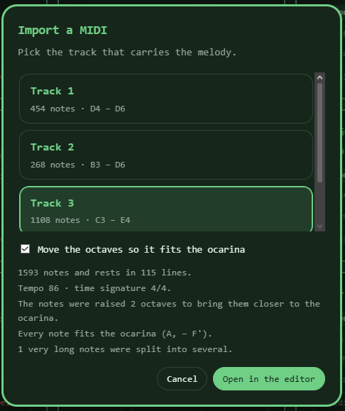</a> | <a href="docs/screenshots/import-audio.png">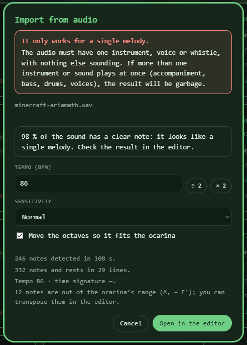</a> |
| MIDI: pick the track with the melody and see what the import will do. | Audio: the window always warns that only a single melody works, and lets you fix the tempo. |

</div>

---

### 📲 **Installable & Offline**
> **Status:** ✅ **FULLY IMPLEMENTED**

The page works as an app you can put on your phone or computer, and keeps working without a connection.

**Key Features:**
- 📴 **Offline** - A service worker keeps the page and your published songs; with no coverage they still open, and a notice tells you when the connection goes and returns
- 🔄 **Updates** - When there is a connection the page and the songs are fetched fresh, so a new version arrives on its own
- ⬇️ **Install** - An *Install the app* link appears in the footer when the browser offers it (Chrome, Edge, Android), and it opens in its own window with its own icon
- 🍎 **iPhone** - Share → *Add to Home Screen*

---

### 🖐️ **Fingerings**
> **Status:** ✅ **FULLY IMPLEMENTED**

Fingering diagrams for the 12-hole ocarina, and a tool to draw the ones that are missing.

**Key Features:**
- 👁️ **Three views** - Note names, fingering diagrams, or both
- 📋 **Fingerings page** - Every note (three octaves, naturals, sharps and flats) with its diagram and whether it is finished
- 🖱️ **Fingering editor** - Pick a note and click the holes that are covered
- ✅ **Finished switch** - Until a fingering is marked as finished, songs keep showing that note by its name

<div align="center">

<a href="docs/screenshots/fingerings-page.png">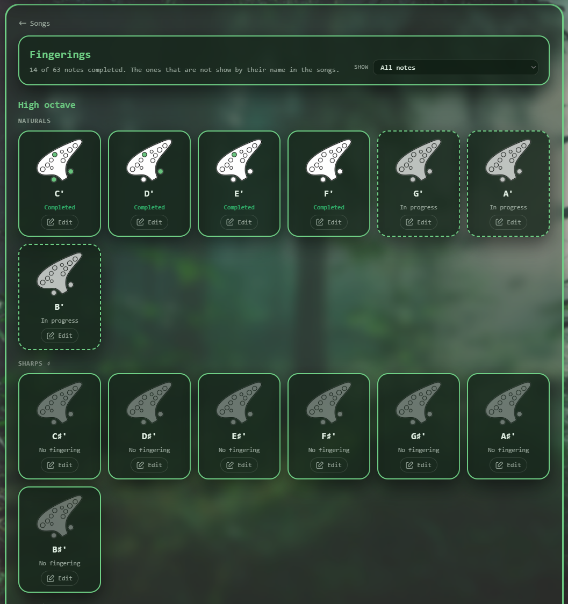</a>

<sub>The fingerings page: finished fingerings in full colour, the ones in progress with a dashed border.</sub>

</div>

<div align="center">

<a href="docs/screenshots/fingering-editor.png">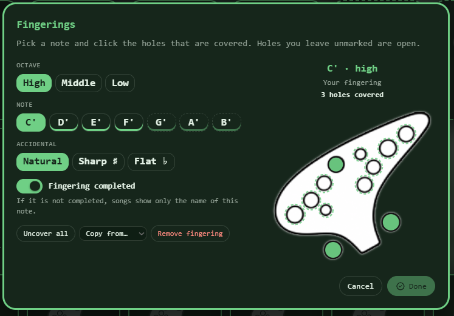</a>

<sub>The fingering editor: pick the note, click the covered holes, and mark it as finished.</sub>

</div>

---

### 🎵 **Key Signatures**
> **Status:** ✅ **FULLY IMPLEMENTED**

The key is worked out from the accidentals you actually use.

<div align="center">

<a href="docs/screenshots/new-song.png">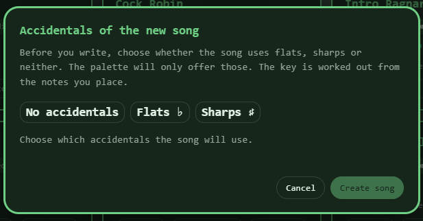</a>

<sub>Every new song starts by choosing its accidentals; the palette then offers only those.</sub>

</div>

**Key Features:**
- ♭♯ **Flats, sharps or none** - The palette only offers the accidentals of the kind you chose
- 🎼 **Live key name** - `B♭ major / G minor`, or `F♯ major / D♯ minor (custom)` when the key is incomplete
- 🔄 **Switch kind** - Flats become sharps (C♯ → D♭, E♯ → F...) and the song sounds exactly the same

---

### 🌍 **Languages**
> **Status:** ✅ **FULLY IMPLEMENTED**

The whole page in Spanish or English.

**Key Features:**
- 🏳️ **One-click switch** - The flag button in the top bar, next to the folder name; your choice is remembered
- 🔤 **Note names** - Do Re Mi… in Spanish, C D E… in English (your song files never change)
- 🧭 **Automatic default** - The first visit follows the browser's language
- 🎵 **Song content stays as written** - Titles, subtitles and tags are never translated

---

### 💾 **Backup & Publishing**
> **Status:** ✅ **FULLY IMPLEMENTED**

**Key Features:**
- 📦 **Backup file** - Every song and fingering in one `.json`, and import it back
- 📱 **Read-only on the web** - Publish the folder with GitHub Pages and read your songs on your phone, even offline
- 🪟 **Several tabs** - Tabs stay in sync, and a song you are editing is never replaced under you

---

## 🌐 Demo

**Live Application:** [https://victorbolanos.github.io/Ocarina-Songbook](https://victorbolanos.github.io/Ocarina-Songbook)

Opened on the web, the page shows the published songs read-only. To create and edit songs, run it in Chrome or Edge on a computer and connect your `songs/` folder (see [Installation](#-installation)).

### 🎨 Customization Options

Everything in the top bar makes the page yours, and it is remembered by the browser:

- 🌙 **Light / Dark mode** - One button; it combines with every colour
- 🎨 **Colour theme** - The *Color* button picks the accent colour of the whole page (buttons, notes, fingering holes, borders): Neutral, Red, Yellow, Green, Cinnamon, Purple, Pink or Blue
- 🔤 **Font** - Six typefaces, from classic to monospaced
- 🖼️ **Background** - The *Background* button lays a picture of your own over the page (see below)
- 🌍 **Language** - Spanish or English

<div align="center">

| The colour menu | The background menu |
|:---:|:---:|
| 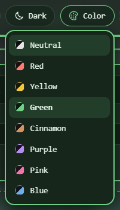 | 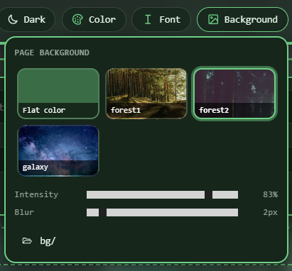 |
| Eight themes, each with its own accent colour | Pictures from your folder, with intensity and blur |

</div>

**Setting a background picture**

1. Open **Background** and press **Link a backgrounds folder**, then pick a folder that holds your pictures (`png`, `jpg`, `webp`, `gif`, `avif` or `bmp`). The `bg/` folder of this project has three samples.
2. Click one of the thumbnails. **Intensity** sets how strongly it shows over the theme colour, and **Blur** softens it so the score stays easy to read.
3. **Flat color** goes back to the plain theme colour.

The picture in use is copied into the browser, so it is there the next time without asking for the folder again; the folder is only needed to pick a different picture (the page may ask you to **Reconnect folder**). Linking the folder needs Chrome or Edge.

---

## 💡 Technologies

### **Frontend Stack**
-  **HTML5** - Semantic markup and native `<dialog>`
-  **CSS3** - Custom properties for the light/dark themes
-  **Vanilla JavaScript** - Classic scripts sharing one `Songbook` namespace, so it even opens from `file://`

### **Browser APIs**
- 🔊 **Web Audio API** - The ocarina voice, the scheduler, the metronome and the offline rendering
- 🎤 **getUserMedia** - The microphone of the note detector (only while its tab is open)
- 📴 **Service Worker & Cache Storage** - Offline use of the page and the songs
- 🎹 **File API & decodeAudioData** - Read the MIDI or audio file you choose (it never leaves your computer)
- 📁 **File System Access API** - Reads and writes your songs folder (Chrome and Edge)
- 🎞️ **WebCodecs** - AAC encoding for MP4 export
- 🗄️ **IndexedDB** - Remembers the folder handle and the background picture
- 📡 **BroadcastChannel** - Keeps several tabs in sync

### **Hosting**
-  **GitHub Pages** - Static hosting for the read-only version

### **Architecture**
- 📦 **No dependencies** - No framework, no bundler, no `node_modules`
- 📄 **Songs as files** - The songs folder is the only place songs are stored
- 🎨 **Single source of truth** - The page is redrawn from one state object
- ☁️ **Zero network use** - The page only reads `songs/` when it is hosted

---

## 🚀 Installation

### **Option 1: Use Online (read-only)**
Visit [https://victorbolanos.github.io/Ocarina-Songbook](https://victorbolanos.github.io/Ocarina-Songbook)

### **Option 2: Run Locally (read and edit)**

```bash
# Clone the repository
git clone https://github.com/VictorBolanos/Ocarina-Songbook.git

# Navigate to the project directory
cd Ocarina-Songbook

# Open index.html in Chrome or Edge (double-click it), or serve the folder:
python -m http.server 8000
# Visit: http://localhost:8000
```

Then click **Connect folder** and pick the `songs/` folder (or the project root that contains it). The browser remembers it; occasionally it asks for permission again — click **Reconnect folder**.

> Opened straight from disk (`file://`) the page can only read songs after you connect the folder. Served over `http(s)`, it also shows the published songs read-only when no folder is connected.

### **Installing it as an app, and offline use**

Served over `https` (GitHub Pages is), the page installs a service worker the first time you open it, and from then on it opens without a connection, with the songs it had then:

- **Chrome / Edge (computer)** - Use the install icon in the address bar, or the *Install the app* link in the footer
- **Android (Chrome)** - Menu → *Install app* (or the footer link)
- **iPhone / iPad (Safari)** - Share → *Add to Home Screen*

Songs are kept up to date whenever there is a connection. If you connect a songs folder (Chrome and Edge) the songs come from the folder as always, connection or not. The service worker does nothing when the page is opened from disk (`file://`), and on `localhost` it stays off so it cannot hide the changes you make: add `?pwa` to the address (`http://localhost:8000/?pwa`) to try it there.

### **Setting up your songs folder**

The page keeps every song as a file, so before you can create or edit songs it needs a folder to keep them in. You do this once per browser:

```
1. Open the page in Chrome or Edge (on a computer, or Chrome on Android)
2. Press "Connect folder" in the top bar
3. Pick the folder that holds your songs and allow the page to edit its files
```

Which folder to pick:

- **The `songs/` folder of this project** - the one you cloned, already with a few songs in it. Picking the project folder itself also works: the page finds the `songs/` inside.
- **A new, empty folder** - Pick any folder. If it has no `songs/` inside, the page asks whether to create one there, and your first saved song fills it in. (Chrome does not allow linking system folders such as Documents, Desktop or Downloads themselves; make a folder inside them, like `Documents/Ocarina`.)

What happens next:

- The top bar shows the folder's name and the footer counts your songs. Each song you save is a `.json` file; the page also keeps `index.json` (the list the web version reads) and `fingerings.json` (your fingerings) up to date.
- The browser remembers the folder. From time to time it asks for permission again: press **Reconnect folder**.
- Files you add or change by hand are picked up when you return to the tab. With several tabs open, they stay in sync.
- Not seeing **Connect folder**? The browser does not support it (Firefox, Safari, iPhone): the page still shows the published songs, read-only.

---

## 📚 User Guide

### **Writing songs**

```
1. Press "New song" and choose none, flats or sharps
2. Set the title, tempo (BPM) and optional time signature
3. Pick notes from the palette, or type them (see the shortcuts below)
4. Use "New line" to break the text; add optional line subtitles
5. Press "Done" to save; "Cancel" or Esc to discard
```

Every note has a **duration**: the *Duration* row shows the value of the selected note (the one before the caret) and changes it; new notes take the value shown. *Dot* lengthens a note by half, and *Rest* adds a rest.

**Duplicate** (on a song's page and on its card) opens a copy called “Title (variant)” in the editor. Like any new song, it is only saved when you press **Done**.

### **Range and transposing**

The 12-hole ocarina plays from A4 to F6 (`La,` to `Fa'` on this page). While you edit, any note outside that range is outlined in red and the palette dims the notes you cannot play; a notice under the form counts them. Press **Transpose…** (in the notice, or next to *Delete song*) to fix it:

<div align="center">

<a href="docs/screenshots/range-warning.png">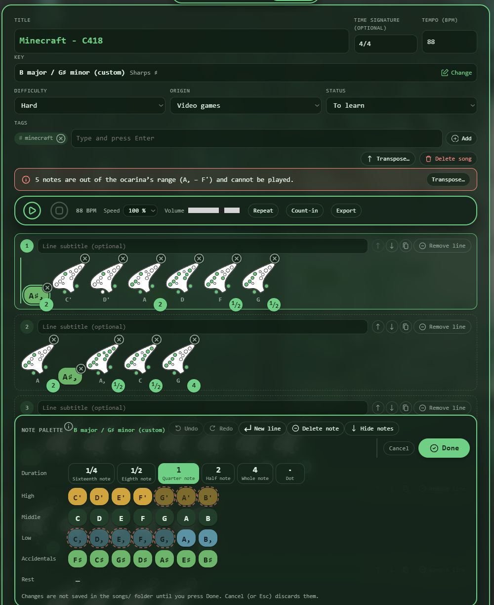</a>

<sub>Notes the ocarina cannot play are outlined in red in the song and dimmed in the palette, and a notice under the form counts them.</sub>

</div>


1. Choose the shift with the buttons: an octave down or up, or half a step down or up (as many times as you like, up to two octaves)
2. Choose whether the new accidentals are written with sharps or flats
3. The window shows how many notes would still be out of range and what the key becomes; a shift that would leave the octaves the page can write (C4–B6) is refused
4. Press **Transpose**; it is one step of the editor's undo

<div align="center">

| Before | Choosing a shift |
|:---:|:---:|
| <a href="docs/screenshots/transpose.png">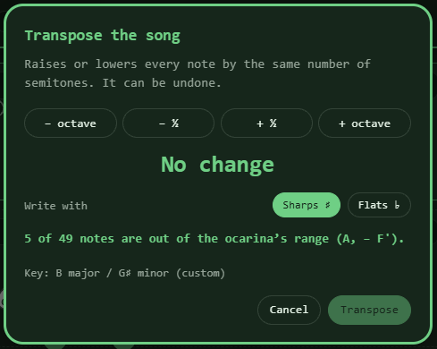</a> | <a href="docs/screenshots/transpose2.png">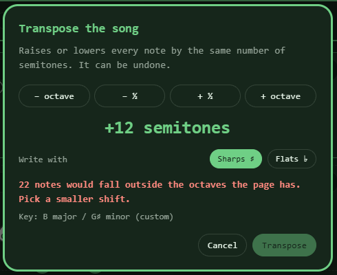</a> |
| Open it and it shows how many notes are out of range. | Shift the song: it checks the result live, and refuses a shift the page cannot write. |

</div>

### **Importing a MIDI file**

On the song list, **Import file** (next to *New song*) reads a `.mid` file. If it has several tracks, pick the one with the melody. The window lists what it found, and the options: *Move the octaves so it fits the ocarina* is on by default. Lines are cut every two bars. Things to know:
- Only one melody line is kept (the top note of every chord), so pick a melody track, not an accompaniment
- Times are snapped to sixteenth notes, so very fast or "swung" playing is simplified
- A note longer than six beats is split into several notes of the same pitch, and a long silence is shortened
- Files timed in frames (SMPTE) cannot be imported

### **Importing from an audio file**

The same **Import file** button also takes audio (`.wav`, `.mp3`, `.m4a`, `.mp4`, `.ogg`, `.flac`…). The page listens to the recording and writes down the notes it hears.

> ⚠️ **It only works for a single melody.** One instrument, one voice, one whistle, with nothing else sounding. If there is more than one instrument or sound at once — a band, chords, a bass line, drums, a choir — the pitch tracker follows now the melody, now the bass, now the noise, and **the result will be garbage**. The window says so every time, and when less than about 60 % of the sound has a clear note it warns that the recording looks like a mix.

What you can adjust in the window:
- **Tempo (BPM)** - Estimated from where the notes start. A recording has no time signature, so the estimate can come out at half or double the real tempo: use **÷ 2** and **× 2**, or type the right one
- **Sensitivity** - *Normal*, *Detailed* (keeps shorter notes, more mistakes) or *Simplified* (ignores brief notes)
- **Move the octaves** - Like the MIDI import

Only the first five minutes are analysed, and files up to 80 MB are accepted. In tests with the page's own recordings, single-voice audio came out with almost every note right and the right tempo; a real recording (breath noise, echo, vibrato, slides between notes) will need more correction in the editor, so treat the result as a first draft.

### **Keyboard shortcuts in the editor**

Hover the **i** next to the palette's title to see them in the page.

| Key | Action |
|---|---|
| `1` – `7` | The notes C D E F G A B (Do Re Mi Fa Sol La Si), in the octave of the previous note |
| `0` | Rest |
| `+` or `#` / `-` or `b` | Sharp / flat on the previous note (only the kind the song uses) |
| `↑` / `↓` | Raise / lower the previous note an octave |
| `s` `e` `q` `h` `w`, `.` | Duration (sixteenth, eighth, quarter, half, whole) and dot |
| `←` / `→`, `Home` / `End` | Move the caret (and choose the note that **Play** starts from) |
| `Backspace` / `Delete` | Remove the note before / after the caret; at the start of a line, join it with the previous one |
| `Enter` | New line |
| `Alt + ↑` / `Alt + ↓`, `Alt + Shift + ↓` | Move the line / duplicate it |
| `Ctrl/Cmd + Z`, `Ctrl/Cmd + Y` | Undo, redo |
| `Ctrl/Cmd + Enter` | Done (save) |
| `Esc` | Cancel and discard the changes |
| `/` | On the song list: jump to the search box |
| `Space` | On a song page (not editing): play / pause |

### **Key signature**

When you create a song you first choose which accidentals it uses: **none, flats or sharps**.

- The palette's **Accidentals** row offers the seven flats (B♭ E♭ A♭ D♭ G♭ C♭ F♭) or the seven sharps (F♯ C♯ G♯ D♯ A♯ E♯ B♯), in the middle octave.
- The **key is worked out from the accidentals you have used** (order, octave and duration don't matter):
  - The furthest accidental in the signature order decides the pair of keys: with B♭ and E♭ it is `B♭ major / G minor`.
  - If one before it is missing, the key is incomplete and is marked `(custom)`.
  - With no accidental used yet, it is `C major / A minor`.
  - The **last note** decides between the major and the minor key (rests don't count).
- **Key** in the editor changes the kind. Between flats and sharps the written notes are replaced by the same sound spelled the other way, so the song sounds exactly the same.

### **Playback & practice**

- **Play from a note** - Click any note on the page; in the editor, click a note (or move onto it with the arrows) and press Play. Editing while it plays stops the music.
- **Speed** - Slows the song down (or speeds it up) without changing its saved tempo.
- **Section** - Press it, then click the first and the last note; Play repeats just that section.
- **Count-in** - A bar of clicks (the top number of an x/4 time signature, otherwise 4) before the song starts.
- **Export** - Choose a format:
  - **MIDI** (`.mid`) - Notes, tempo, time signature and key on the Ocarina instrument, for score editors and music programs.
  - **WAV** (`.wav`) - Mono 16-bit 22.05 kHz audio, about 2.6 MB a minute.
  - **MP4** (`.mp4`) - The same audio compressed with AAC, about 0.7 MB a minute. Needs a browser with the WebCodecs AAC encoder (current Chrome and Edge).
  - **PNG** (`.png`) - The score as an image, one staff per line of the song. You choose whether names, fingering diagrams or both are written under the notes; the note values are always drawn. The picture is black on white with a treble clef, the key signature, the time signature and, when the notes fit the time signature, bar lines. A very long score is drawn a little smaller on phones, whose browsers limit the size of an image.
- **Metronome** - Set the tempo with the arrows, the slider or by typing, or tap it. Choose the beats per bar and a subdivision. It keeps ticking after you close the window.
- **Note detector** - In the metronome window, open the **Note detector** tab and press **Turn the microphone on** (the browser asks for permission the first time). Hold the ocarina near the microphone and play one note at a time: the note, its frequency and the needle appear as you play. To practise a particular note, press its bubble in **Note to practise**: the message then says whether you are above or below it, and the needle is centred on that note (red when you are on another note). It works best in a quiet room; if the metronome or a song is playing through the speakers, the microphone will hear it too, so use headphones. The microphone needs a secure address: `https` (GitHub Pages is), `localhost`, or a page opened from disk.

### **Fingerings**

The middle-octave notes come with their fingering diagram. Any other note (other octaves, sharps and flats) shows as a name chip until it has one.

The **Fingerings** button in the top bar opens the fingerings page: every note with its diagram and whether it is finished, with a filter for the finished or the pending ones. With the songs folder connected each note has an **Edit** button that opens the fingering editor on it:

1. Pick the **octave**, the **note** and the **accidental**.
2. The ocarina shows the fingering that note has now (all holes open if it has none).
3. Click a hole to cover or uncover it (holes are numbered right to left, 1 to 12).
4. **Uncover all** opens every hole, **Copy from…** starts from another note's fingering, and **Remove fingering** removes yours.
5. The **Fingering completed** switch says whether it is finished; until it is on, songs show that note by its name.
6. **Done** saves, **Cancel** or `Esc` discards.

### **Backup**

At the bottom of the page, **Export backup** saves every song and fingering in one `.json` file, and **Import backup** (with the folder connected) adds a backup's songs to yours. A song already there as it is gets skipped, one with the same id but different content is added under another name, and the backup's fingerings replace those of the same notes. Nothing you have is deleted.

### **Publishing the songs on the web**

Without a connected folder the page can still show the songs that sit next to it, read-only. That is what happens on a phone once the project is hosted, for example with GitHub Pages:

```
0. node tools/stamp-version.js        (before you commit; see below)
1. Edit and save songs on your computer as usual
   (every save also updates songs/index.json, the list a web page needs)
2. Commit and push songs/ (with index.json), and GitHub Pages serves them
3. Open the page on the phone: the toolbar says "Read-only"
```

`tools/stamp-version.js` also writes the list of files and the version in `sw.js`, which is what makes a new version replace the copies kept for offline use, so commit `sw.js` and `index.html` together with your changes.

With GitHub Pages: in the repository, *Settings → Pages → Deploy from a branch → `main` / root*. `tools/stamp-version.js` adds a fingerprint to the script and style addresses in `index.html`, so a phone loads new files at once instead of after GitHub Pages' ten minutes of cache.

---

## 🗂️ Song Files

One file per song in `songs/`; the file name is the song id.

```json
{
  "id": "zeldas-lullaby",
  "title": "Zelda's Lullaby",
  "meter": "3/4",
  "bpm": 96,
  "signature": "none",
  "difficulty": "",
  "origin": "",
  "status": "",
  "tags": ["zelda"],
  "lines": [
    { "subtitle": "Part 1", "notes": ["Mi:h", "Sol", "Re:h."] },
    { "subtitle": "", "notes": ["Do", "Re", "Mi:h", "R:h"] }
  ]
}
```

| Field | Meaning |
|---|---|
| `id` | Unique, file-name safe; matches the file name |
| `title`, `meter` | Title and optional time signature badge |
| `bpm` | Tempo in quarter notes per minute, 30 to 240 (100 if missing) |
| `signature` | Accidentals the song uses: `"none"`, `"flat"` or `"sharp"` (the key is worked out from the notes) |
| `difficulty`, `origin`, `status` | An option key from `js/categories.js`, or `""` |
| `tags` | Free-form labels (up to 12) |
| `lines` | Lines, each with an optional `subtitle` and its `notes` |

**Notes.** Files store notes with the solfège names `Do Re Mi Fa Sol La Si` (C D E F G A B), whatever the language of the page, with optional suffixes: `#` for sharp or `b` for flat, and an octave mark: `_` low, `^` high (`^^`, very high, still plays and shows if an old song uses it). So `Re` is a middle-octave Re, `Fa#^` a high Fa sharp and `Sib` a Si flat.

**Durations.** After the pitch, `:` and a value: `w` whole, `h` half, `q` quarter (the default, so it is omitted), `e` eighth, `s` sixteenth; add `.` to dot it. `Re:h` is a half note, `Fa#^:e.` a dotted eighth. `R` is a rest and takes durations too: `R:h`.

Files can be edited by hand. Changes are picked up when you come back to the browser tab; unreadable files are skipped and never overwritten. Notes that are not valid (a typo like `Xx`) are left out of the page, and the page tells you which song has them, because they would be lost the next time that song is saved.

**Other files in `songs/`**: `index.json` (the list of song files, kept up to date by the page) and `fingerings.json` (the fingerings you draw, one note per line):

```json
{
  "fingerings": {
    "Sol#^": { "holes": [7, 10, 11], "done": true },
    "Do^": { "holes": [1, 2, 3, 4, 5, 7, 8, 10, 11], "done": false }
  }
}
```

The key is the note without a duration, `holes` are the covered holes and `done` says whether the fingering is finished.

### **Several windows, several tabs**

Two tabs of the page (or a hand edit) can touch the same folder. When one tab saves, the others read the folder again. A song you have open in the editor is never replaced under you: you get a warning if its file changes, and pressing **Done** asks before overwriting a file that changed since you opened the song.

---

## 🏗️ Project Structure

```
Ocarina-Songbook/
├── 📁 css/
│   └── styles.css            # Themes, light/dark, glass cards
├── 📁 js/                    # Plain scripts sharing one Songbook namespace
│   ├── i18n.js               # Spanish / English: dictionary, note names, language switch
│   ├── notes.js              # Note model, pitches, durations
│   ├── keys.js               # Key signatures
│   ├── fingering.js          # Fingering diagrams (built-in + yours)
│   ├── icons.js              # Generated from src/svg (see tools/)
│   ├── categories.js         # Difficulty, origin, status
│   ├── ui.js, menus.js       # DOM helper, toast, dialogs, menus
│   ├── store.js              # State, undo, saving
│   ├── router.js             # #/, #/song/<id>, #/digitaciones
│   ├── home.js               # Song list, search, filters
│   ├── key-dialog.js         # Flats / sharps / none picker
│   ├── transpose.js          # Transposing the song being edited
│   ├── midi-import.js        # Reading a MIDI file into a song
│   ├── audio-import.js       # Listening to an audio file and writing the melody down
│   ├── metronome.js          # The metronome window and its two tabs
│   ├── pitch.js              # The note detector (microphone, YIN pitch detection)
│   ├── audio.js              # The ocarina voice and the scheduler
│   ├── export.js             # MIDI, WAV, MP4 and PNG export
│   ├── score-image.js        # The score drawn as an image
│   ├── ocarina-image.js      # The ocarina picture as data (generated)
│   ├── pwa.js                # Service worker registration, install link, connection notices
│   ├── player.js             # The play bar
│   ├── render.js             # Song pages and the editor view
│   ├── editor.js             # Editing logic and keyboard
│   ├── folder.js             # The songs folder (read, write, sync)
│   ├── background.js         # Page background picker
│   ├── preferences.js        # Theme, font, view
│   ├── fingering-editor.js   # The fingering editor
│   ├── fingering-page.js     # The page of all fingerings
│   ├── backup.js             # Backup export / import
│   └── app.js                # Start-up
├── 📁 songs/                 # Your songs: one JSON file each
│   ├── index.json            # The list of songs (kept up to date)
│   └── fingerings.json      # The fingerings you draw
├── 📁 src/
│   ├── img/                  # Logo and the ocarina picture
│   └── svg/                  # Source icons
├── 📁 bg/                    # Sample background pictures
├── 📁 tools/
│   ├── build-icons.js        # src/svg → js/icons.js
│   ├── build-images.js       # src/img/ocarina_base.png → js/ocarina-image.js
│   ├── build-pwa-icons.py    # src/img/ocarina_title.png → the app icons (needs Pillow)
│   └── stamp-version.js      # Cache-busting fingerprints in index.html, and the file list of sw.js
├── index.html                # The page shell
├── sw.js                     # The service worker (offline use); its file list is generated
├── manifest.webmanifest      # The app's name, colours and icons
└── README.md                 # This file
```

### **Customising**

- **Languages** - Every text is written in Spanish in the code and in `index.html`. The English versions are in the `EN` dictionary at the top of `js/i18n.js`, keyed by the Spanish text; a text that is missing there just stays in Spanish. Text with a variable part (a title, a number) is written as `t('… {name} …', { name })` so the variable is never translated. Anything inside an element marked `translate="no"` is left alone.
- **Categories** - Add a category, or options to one, in `js/categories.js`. The editor, the list filters and the JSON files all follow it.
- **Ocarina picture** - If you change `src/img/ocarina_base.png`, run `node tools/build-images.js` so the score image uses the new one, then `node tools/stamp-version.js`. (The picture is written into a script because a canvas that drew a file loaded from disk cannot be saved when the page itself is opened from disk.)
- **App icons** - The icons of the installed app (`src/img/icon-*.png`, `apple-touch-icon.png`) are made from the logo, `src/img/ocarina_title.png`, with `python tools/build-pwa-icons.py`. The logo is 128 pixels wide, so the big sizes are enlarged from it; drop in a bigger logo and run the script again for sharper ones.
- **Ocarina range** - The range the editor warns about (A4 to F6) is `RANGE` in `js/notes.js`.
- **Icons** - Put SVGs in `src/svg/` and run `node tools/build-icons.js`, then `node tools/stamp-version.js`. Each icon is inlined with its colours replaced by `currentColor`, so it follows the theme.
- **Ocarina pitches** - The page assumes the usual 12-hole alto C ocarina: `Do` (all ten finger holes closed, both small holes open) is C5, the middle octave is C5 to B5, `_` notes go down to A4 and B4, and `^` notes up to F6. To change the mapping, edit `OCTAVES` in `js/notes.js`.
- **The voice** - An ocarina is a Helmholtz resonator: its tone is very close to a pure sine wave. The voice in `js/audio.js` is a near-sine wave table with a little breath noise, a soft attack, a slight pitch scoop, a gentle vibrato and a touch of room reverb. Every knob is in the `TIMBRE` object at the top of that file.

---

## 🔥 Key Highlights

### **🔒 Private by design**
- Songs only live in your `songs/` folder
- Theme, font and audio settings stay in the browser's local storage
- The only network requests are the ones that read `songs/` when the page is hosted
- The microphone is used only while the note detector is on, and what it hears is never recorded or sent

### **🛡️ Safe with your data**
- Nothing is written until you press **Done**
- A file added or changed by hand while you edit is never overwritten silently
- A damaged `fingerings.json` is kept as `fingerings.json.bak` before it is replaced

### **⚡ Light and fast**
- No dependencies, no build step
- Audio is scheduled ahead of time on the audio clock, so playback stays steady
- Exports are rendered in the browser, faster than real time; the score image is drawn on a canvas with no library

### **🌍 Browser support**
- Editing needs the File System Access API: **Chrome and Edge on desktop**
- Any modern browser, phones included, can read the published songs; Chrome on Android can also connect a folder and edit
- **Phone layout**: on narrow screens the note palette is a compact sheet at the bottom (closed to a slim bar until you open it, and a side panel when the phone is held sideways, so it never covers the score), the player and the filters fold away, and every control has a finger-sized target
- MP4 export needs the WebCodecs AAC encoder (current Chrome and Edge)
- Offline use and installing need `https` (or `localhost`); importing a MIDI or audio file needs a folder you can write to, like editing does

---

## 📊 Feature Status

| Feature | Status | Description |
|---------|--------|-------------|
| 🎼 Song library | ✅ **Complete** | Search, filters, categories and tags |
| ✍️ Song editor | ✅ **Complete** | Palette, keyboard entry, lines, undo, variants |
| 🔊 Playback | ✅ **Complete** | Ocarina voice, speed, stretch, count-in |
| 📤 Export | ✅ **Complete** | MIDI, WAV, MP4 and PNG |
| 🖼️ Score image | ✅ **Complete** | One staff per line, real note values |
| 🎚️ Metronome | ✅ **Complete** | Tempo, tap, beats, subdivisions |
| 🎤 Note detector | ✅ **Complete** | The note you play, how in tune it is, and practising one note |
| 🖐️ Fingerings | ✅ **Complete** | Diagrams page and editor |
| 🎵 Key signatures | ✅ **Complete** | Flats, sharps, live key name |
| 💾 Backup | ✅ **Complete** | Export and import everything |
| 🌍 Languages | ✅ **Complete** | Spanish and English |
| 📱 Read-only web version | ✅ **Complete** | GitHub Pages, phone friendly |
| 📲 Installable / offline (PWA) | ✅ **Complete** | Install as an app, open without a connection |
| 🎹 MIDI & audio import | ✅ **Complete** | A melody from a `.mid` file or a single-voice recording, fitted to the ocarina |
| 🔄 Transpose & range warning | ✅ **Complete** | Shift the song, and see what the ocarina cannot play |
| 🎤 Play-along with the microphone | 📋 **Planned** | Check what you play against the song (the note detector is the first step) |

---

## 👤 Author

**Victor Bolaños**

- GitHub: [@VictorBolanos](https://github.com/VictorBolanos)
- Project: [Ocarina Songbook](https://github.com/VictorBolanos/Ocarina-Songbook)

---

## 🙏 Acknowledgments

- **[SVG Repo](https://www.svgrepo.com)** - For the icons used in the interface
- **YIN** (Alain de Cheveigné and Hideki Kawahara, 2002) - The pitch-detection algorithm behind the note detector and the audio import
- **The Web platform** - Web Audio, File System Access and WebCodecs make a page like this possible without a single dependency
- **Ocarina players everywhere** - For the inspiration

---

## 🔖 Version

**Current Version:** 1.1.0  
**Last Updated:** September 21, 2026

---

<div align="center">

**Made with ❤️ for ocarina players**

**Happy playing! 🎶**

</div>
